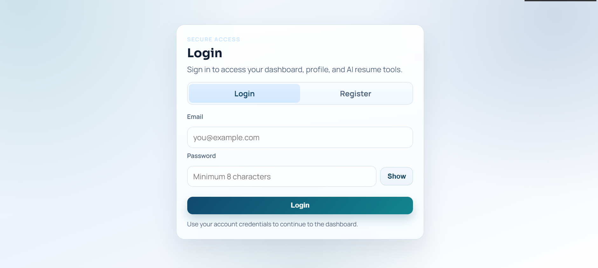
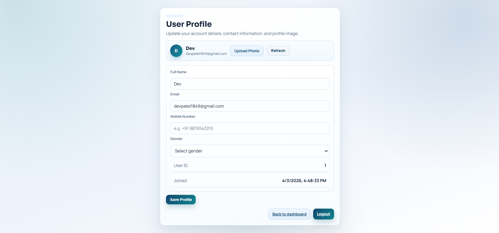
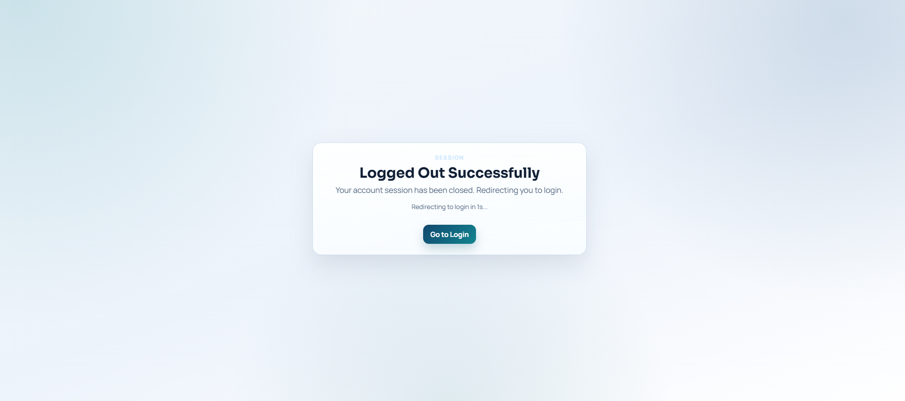

# Resume AI

Resume AI is a full-stack application that helps users generate targeted, professional resumes from their background, old resume, GitHub projects, and a target job description.

It uses AI for content generation and template-based PDF rendering for downloadable resumes.

## What This Project Does

- Collects candidate source input (manual text, old resume, and GitHub profile).
- Filters GitHub repositories to keep only useful, described projects.
- Matches projects to the job description and uses only top relevant projects.
- Generates a professional resume in structured sections.
- Exports the resume as PDF using selectable templates.

## Core Features

- User authentication (register, login, profile, logout).
- GitHub repository fetch and relevance filtering.
- Resume parsing from `.pdf`, `.txt`, and `.md` uploads.
- AI-powered resume generation with template-aware style instructions.
- 5 template options:
	- ATS Professional
	- Modern Impact
	- Executive Brief
	- Technical Deep
	- Classic Serif
- Template-based PDF download.

## Prototype Screenshots

Add your UI prototype images in this folder:

- `resume-ai/resume-ai/frontend-react/public/prototypes/`

Then README will show them with page names:

### Login Page



### User Profile Page



### Logout Page



### Full Prototype Demo (MP4)

[Watch Prototype Video](resume-ai/resume-ai/frontend-react/public/prototypes/prototype.mp4)

## Tech Stack

- Frontend: React + Vite
- Backend: FastAPI
- AI: OpenRouter API
- PDF: ReportLab
- Resume Parsing: pdfplumber
- Storage/Auth: Local backend auth service (project-level implementation)

## Project Structure

The main application code is in:

- `resume-ai/resume-ai/`

Important folders:

- `resume-ai/resume-ai/backend/app/` - API routes, services, models
- `resume-ai/resume-ai/frontend-react/src/` - UI pages, context, API client

## How To Run The Project

## 1) Backend Setup

Open terminal in:

- `resume-ai/resume-ai/backend`

Install dependencies:

```bash
pip install -r requirements.txt
```

Create/update `.env` in backend folder (example values):

```env
OPENROUTER_API_KEY=your_openrouter_key
GITHUB_TOKEN=your_github_token_optional
PINECONE_API_KEY=your_pinecone_key_optional
PINECONE_ENV=your_env_optional
PINECONE_INDEX=resume-ai
```

Start backend:

```bash
uvicorn app.main:app --reload
```

Backend default URL:

- `http://127.0.0.1:8000`

## 2) Frontend Setup

Open terminal in:

- `resume-ai/resume-ai/frontend-react`

Install dependencies:

```bash
npm install
```

Run frontend:

```bash
npm run dev
```

Build frontend:

```bash
npm run build
```

## 3) Typical User Workflow

1. Register or login.
2. Open dashboard.
3. Paste career/source text.
4. Paste job description.
5. Add GitHub username and fetch projects.
6. System keeps only repositories with valid descriptions.
7. System selects top relevant 3-4 projects for resume context.
8. Upload old resume (optional) for better tailoring.
9. Choose a resume template.
10. Generate resume.
11. Download professional PDF.

## API Highlights

- `POST /auth/register`
- `POST /auth/login`
- `GET /auth/profile`
- `PUT /auth/profile`
- `POST /auth/logout`
- `POST /github/github` - fetch and filter GitHub repositories
- `POST /resume/parse-file` - parse old resume file
- `POST /resume/generate` - generate AI resume
- `POST /resume/download-pdf` - download template-based PDF

## Benefits Of This Project

## For Job Seekers

- Saves time creating role-specific resumes.
- Improves resume relevance to job descriptions.
- Converts GitHub work into resume-ready project bullets.
- Produces professional formatting quickly.

## For Recruiter/ATS Compatibility

- Supports ATS-friendly structure.
- Emphasizes measurable achievements and keywords.
- Keeps resume sections clean and readable.

## For Portfolio Impact

- Connects coding projects directly with career documents.
- Highlights technical depth from real repositories.
- Helps candidates present practical experience clearly.

## Troubleshooting

- If AI generation fails:
	- Verify `OPENROUTER_API_KEY` in backend `.env`.
	- Restart backend after changing `.env`.
- If GitHub fetch fails:
	- Check username format (`username` or full profile URL).
	- Check internet access and GitHub rate limits.
	- Use `GITHUB_TOKEN` for better API reliability.
- If PDF download looks plain:
	- Confirm you selected a template before generation/download.

## Future Improvements

- Add live resume preview by template before PDF download.
- Add editable section-level controls in UI.
- Add role-based keyword scoring dashboard.
- Add export to DOCX format.

## License

This project is available under the repository license.